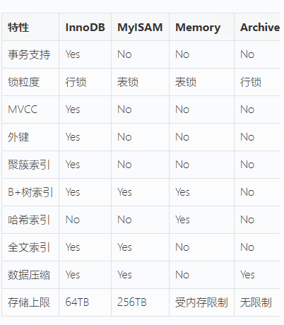

MySQL有哪些存储引擎

# 1.常见的存储引擎
1.InnoDB:默认存储引擎，支持事务、行级锁、外键，支持MVCC。数据按照聚集索引组织。

2.MyISAM：不支持事务，只有表级锁，没有行级锁。查询速度快。适合读多写少，一致性要求不高的场景。

3.Memory：数据存储在内存中，速度极快，重启后数据丢失，适合临时表、缓存等

4.Archive：高压缩比，只支持 INSERT 和 SELECT，不支持索引（除主键），适合日志、归档数据。

99%的业务场景直接使用InnoDB就完事了，MySQL5.5之后InnoDB就是默认引擎，官方一直在优化。MyISAM基本被淘汰了。MySQL8.4支持了10个引擎。

# MyISAM既然只有表锁，为什么说读性能好？
因为没有事务开销，不用维护undo log，不用做MVCC版本链查找。读的时候从B+树拿到地址，去数据文件里顺序读。但是是在没有并发、写请求少的情况下，在写操作多的情况下，表锁会把所有读都阻塞住，性能就崩溃了。

