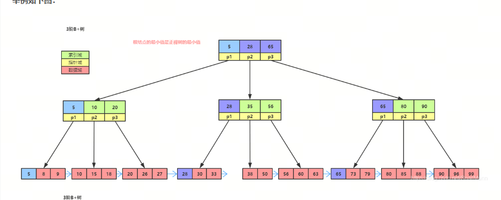

MySQL 索引是提升查询效率的核心机制，本质是有序的数据结构（如 B + 树、哈希表），用于快速定位表中数据，避免全表扫描。索引的设计、类型选择及层级适配直接决定数据库性能，以下从索引核心概念、类型、底层原理、不同层级（单表 / 分库分表）的适用数据量展开讲解。

## 一、索引的核心基础
1. 索引的本质与作用

本质：以空间换时间，为表数据建立 “目录”，将无序的数据转化为有序的索引结构，查询时通过索引快速定位数据位置。

核心作用：
* 加速查询（SELECT）：避免全表扫描，尤其是大表；
* 优化排序 / 分组（ORDER BY/GROUP BY）：利用索引的有序性直接排序，无需临时表；
* 约束数据（唯一索引 / 主键索引）：保证数据唯一性。

副作用：减慢写入（INSERT/UPDATE/DELETE），因为修改数据时需同步更新索引；占用额外磁盘空间。

2. 索引的核心分类（按数据结构）

MySQL 支持多种索引结构，最常用的是 B + 树索引

|索引类型|	底层结构|	适用场景|	优势|	劣势|
|--|--|--|--|--|
|B + 树索引|	B + 树（有序）|	绝大多数场景（等值 / 范围查询）	支持等值 / 范围 / 排序查询|	写入有额外开销|
|哈希索引|	哈希表|	等值查询（如 Memcached 类场景）|	等值查询极快（O (1)|）	不支持范围 / 排序查询，仅 Memory 引擎默认|
|全文索引|	倒排索引|	文本模糊查询（如文章内容搜索）|	支持自然语言模糊查询|	仅 MyISAM/InnoDB（5.6+）支持，性能一般|
|R 树索引|	R 树|	空间数据查询（如地理位置）	|支持空间范围查询|	仅 MyISAM 支持，使用极少|

InnoDB 引擎仅支持 B + 树索引（含主键 / 普通 / 唯一 / 联合索引），哈希索引需手动模拟.

## B + 树索引的底层原理（InnoDB 核心）
**1. B + 树的结构特征**

**B + 树是平衡多路查找树，专为磁盘 IO 优化设计，核心结构：**
* **非叶子节点**：仅存储索引键和子节点指针，不存数据，用于快速定位；
* **叶子节点**：
1.存储完整索引键 + 数据（聚簇索引）/ 主键值（二级索引）；
2.所有叶子节点通过双向链表连接，支持范围遍历；

层高极低：通常 3-4 层即可支撑千万级数据（每层可存储数百个索引键）。

**2.聚簇索引 vs 二级索引**
|索引类型|	叶子节点存储内容|	查询流程|	适用场景|
|--|--|--|--|
|聚簇索引|	主键值 + 整行物理数据|	直接定位数据，无需回表	主键查询、单行查询|
|二级索引|	索引键 + 主键值	先查二级索引得主键，再回表查聚簇索引（回表）|	非主键字段查询|

InnoDB 表必须有聚簇索引（主键），若无主键则自动选唯一非空索引，否则生成隐式行 ID（DB_ROW_ID），因此建表必须显式指定主键

**3. B + 树的 IO 优势**
磁盘 IO 是数据库性能瓶颈，B + 树通过 “层高低 + 顺序 IO” 优化：
层高 3 层的 B + 树：
第一层（根节点）：1 个页（16KB），加载到内存；
第二层（分支节点）：约 1000 个页（假设每个索引键 + 指针占 16 字节，16KB/16B=1000）；
第三层（叶子节点）：约 1000*1000=100 万页，每页存 100 行数据 → 总数据量 1 亿行。
查询仅需 3 次 IO（根→分支→叶子），远优于全表扫描的数万次 IO。

## 三、索引的常用类型（按业务逻辑）
基于 B + 树的业务分类，覆盖日常开发所有场景：
**1. 主键索引**
唯一非空，InnoDB 的聚簇索引，表必须有且仅有一个；
建议用自增 INT/BIGINT（有序插入，避免 B + 树分裂，提升写入性能），避免用 UUID（无序，导致频繁分裂）。
**2. 唯一索引**
索引键值唯一（允许 NULL，需注意：NULL≠NULL）；
底层也是 B + 树，仅多了唯一性校验，查询效率与主键索引接近；
适用：手机号、身份证号等唯一字段。
**3. 普通索引**
无唯一性约束，最常用；
底层 B + 树，查询效率略低于唯一索引（无唯一性优化）；
适用：姓名、状态、时间等非唯一字段。
**4. 联合索引（复合索引）**
多个字段组合的索引（如idx_name_age (name, age)）；
遵循 “最左前缀匹配原则”：查询条件需匹配索引最左字段，否则索引失效；
示例：idx_name_age支持name、name+age查询，不支持age单独查询；
适用：多字段组合查询（如 “按姓名 + 年龄查用户”）。
**5. 覆盖索引**
二级索引包含查询所需所有字段，无需回表；
示例：查询SELECT id, name FROM user WHERE name='张三'，若有idx_name (name)，则name+ 主键id已覆盖结果，无需回表；
核心优势：避免回表 IO，提升查询效率，是优化大表查询的核心手段。

四、不同索引层级的适用数据量
索引的 “层级” 可理解为：单表索引支撑量、分库分表后索引支撑量、索引层高与数据量的关系，以下分维度说明：
**1. 索引层高与数据量的对应关系（B + 树**
B + 树的层高直接决定查询 IO 次数，不同层高的支撑能力：

|B + 树层高|	单表理论支撑数据量|	实际建议数据量|	说明|
|--|--|--|--|
|2 层|	约 10 万行|	≤5 万行	|根节点→叶子节点，仅 1 次 IO，极致高效|
|3 层|	约 1000 万行|	≤500 万行|	根→分支→叶子，3 次 IO，主流场景最优|
|4 层|	约 1 亿行|	≤1000 万行|	4 次 IO，查询效率下降，建议分库分表|
|≥5 层|	超 10 亿行|	不建议|	IO 次数过多，索引失效，必须分库分表|

**. 分库分表后索引的适用数据量**
当单表数据量超过 1000 万行，需分库分表（水平分表为主），此时索引按 “分表” 独立维护，整体支撑能力大幅提升：

分表规则：按主键 / 业务字段（如用户 ID 取模）拆分，每个分表数据量控制在 100-500 万行；

索引策略：每个分表独立建立主键 / 普通索引，索引层高保持 3 层；

支撑能力：

* 10 个分表：总数据量 1000 万 - 5000 万行，索引查询效率与单表一致；
* 100 个分表：总数据量 1 亿 - 5 亿行，需结合路由中间件（如 Sharding-JDBC）优化索引查询；
*超 100 个分表：需分库 + 分表，每个库的分表数≤20，避免跨库索引查询性能损耗。

五、索引设计的核心原则（适配数据量）
* 控制索引数量：单表索引≤5 个，过多会导致写入性能暴跌（每次写入需更新所有索引）；
* 优先用覆盖索引：减少回表 IO，尤其大表（≥100 万行）；
* 避免索引失效：

不做函数操作（如DATE(create_time) = '2024-01-01'）；

不做隐式类型转换（如id='123'，id 为 INT）；

模糊查询避免前导 %（如LIKE '%张三'）；

* 大表索引优化：
数据量≥500 万行：拆分表，或用分区表（按时间 / 地区分区，索引按分区维护）；

数据量≥1 亿行：必须分库分表，结合读写分离；

监控索引使用率：通过sys.schema_unused_indexes排查无用索引，及时删除，减少写入开销。