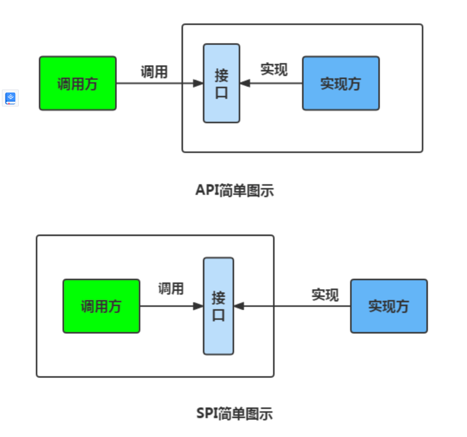
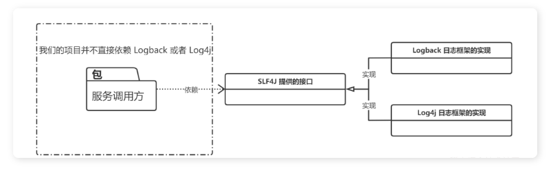

Java SPi 

# 什么是SPI
SPi 即Service Provider Interface ， 意思是服务者提供接口。专门提供给服务提供者使用的一个接口。
SPI 将服务接口和具体的服务实现分离开来，将服务调用方和服务实现者解耦，能够提升程序的扩展性、可维护性。修改或者替换服务实现并不需要修改调用方。

# SPI和API的区别

一般模块之间都是通过通过接口进行通讯，那我们在服务调用方和服务实现方（也称服务提供者）之间引入一个“接口”。
当实现方提供了接口和实现，我们可以通过调用实现方的接口从而拥有实现方给我们提供的能力，这就是 API ，这种接口和实现都是放在实现方的。
当接口存在于调用方这边时，就是 SPI ，由接口调用方确定接口规则，然后由不同的厂商去根据这个规则对这个接口进行实现，从而提供服务。

举个通俗易懂的例子：公司 H 是一家科技公司，新设计了一款芯片，然后现在需要量产了，而市面上有好几家芯片制造业公司，这个时候，只要 H 公司指定好了这芯片生产的标准（定义好了接口标准），那么这些合作的芯片公司（服务提供者）就按照标准交付自家特色的芯片（提供不同方案的实现，但是给出来的结果是一样的）。

SLF4J （Simple Logging Facade for Java）是 Java 的一个日志门面（接口），其具体实现有几种，比如：Logback、Log4j、Log4j2 等等，而且还可以切换，在切换日志具体实现的时候我们是不需要更改项目代码的，只需要在 Maven 依赖里面修改一些 pom 依赖就好了。
