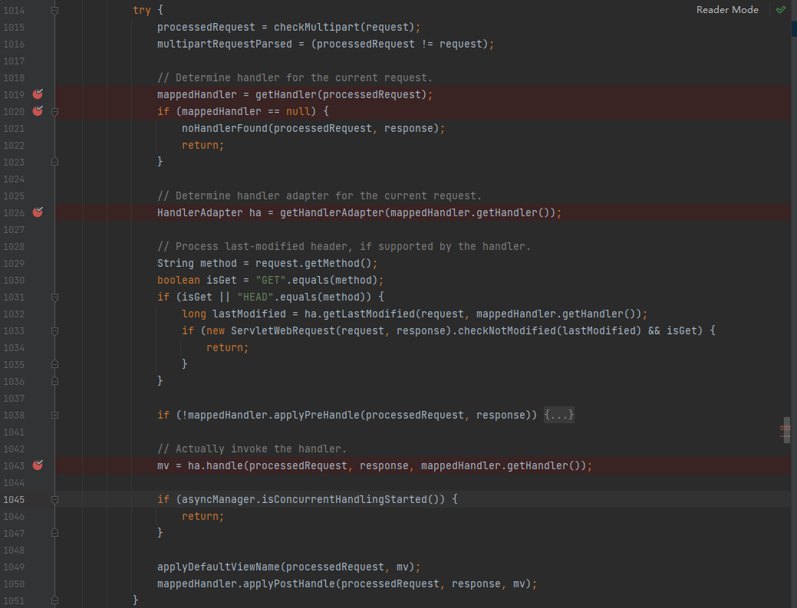

### 
@SpringBootApplication注解包含了三个注解，其中包含了@EnableAutoConfigurationz自动装配注解。对于DispatcherServlet的自动注册，主要是通过DispatcherServletAutoConfiguration类来实现的。
具体逻辑大致如下：
1.DispatcherServletAutoConfiguration类被@ConditionalOnClass注解修饰，这个注解表示当类路径中存在DispatcherServlet类时，这个自动配置类才会生效。
2.在DispatcherServletAutoConfiguration类中，使用@ConditionalOnMissingBean(DispatcherServlet.class)注解来判断当前Spring上下文中是否已经存在DispatcherServlet的Bean。如果不存在，才会自动配置DispatcherServlet。
3.根据@Bean来创建dispatcherServlet类，根据@Bean生成DispatcherServletRegistrationBean类。
4.启动了Spring Boot应用时，内置的Tomcat、Jetty或Undertow等Servlet容器会启动，最终将DispatcherServlet注册为处理所有HTTP请求的Servlet

DispatcherServlet的doDispatch(HttpServletRequest request, HttpServletResponse response)方法来真正处理http请求。

具体处理流程：
1. 针对当前的request，经过注册的Mapping（主要是RequestMappingInfoHandlerMapping）的getHandlerInternal方法获取HandlerMethod，getHandlerInternal实际是通过访问的url在所有url注册的this.mappingRegistry Map中直接获取到对应的HandlerMethod，再通过HandlerMethod、一批HandlerInterceptor生成HandlerExecutionChain。

2. 通过HandlerExecutionChain中方法的HandlerMethod来获取HandlerAdapter。

3. 通过获取的HandlerAdapter(即RequestMappingHandlerAdapter)执行handler方法来实际执行url对应的具体方法。