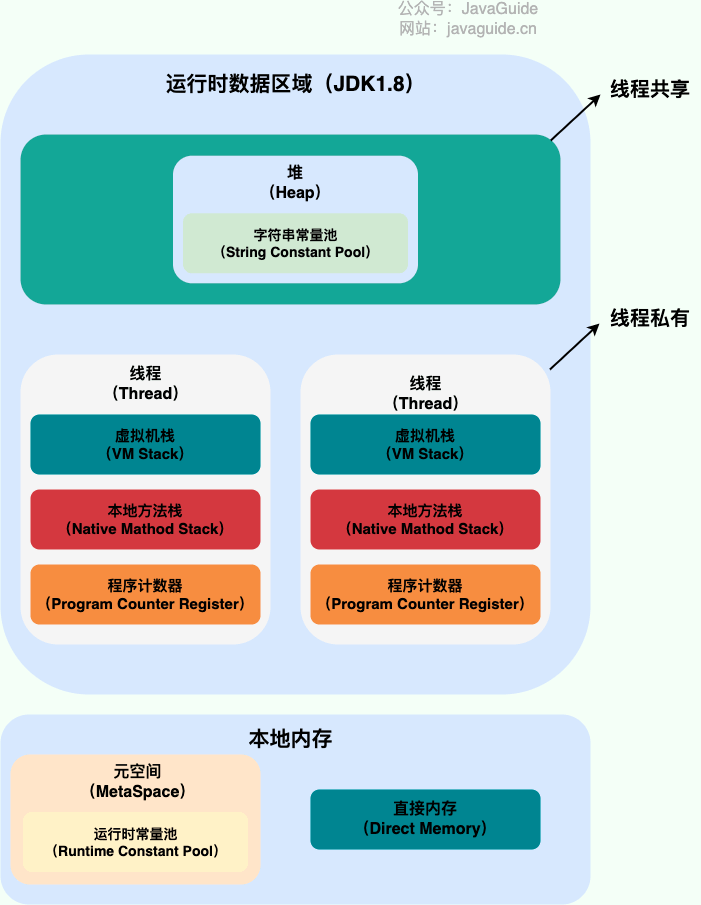
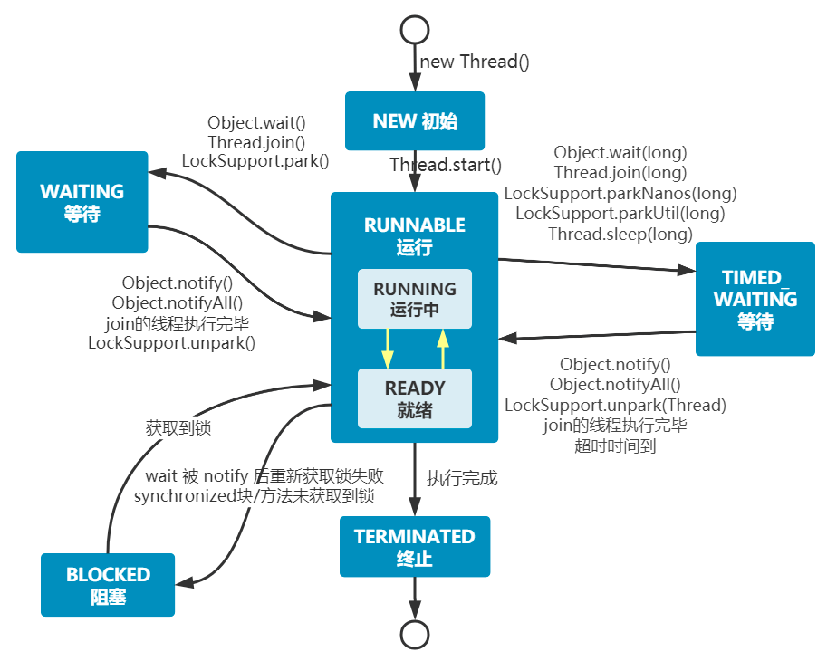
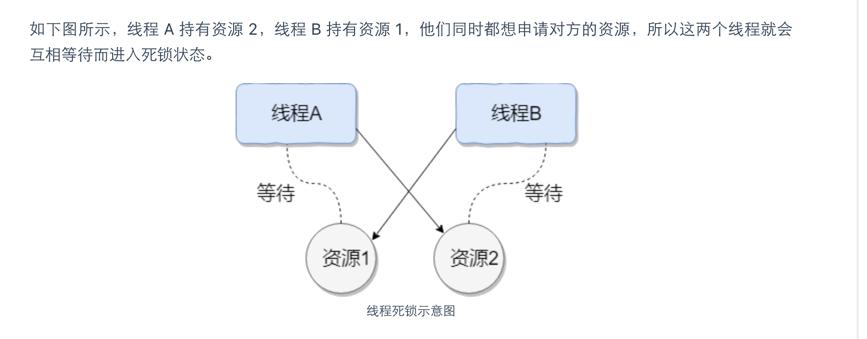

### 进程
进程是系统运行的基本单位。系统运行一个程序就是一个进程从创建、运行到消亡的过程。
通过任务管理器看到的都是程序的进程。

### 线程
比进程更小的执行单位，一个进程可以包含多个线程。多个线程共享进程的堆和方法区资源，
每个线程有自己的程序计数器、虚拟机栈和本地方法栈。线程切换的负担要小于进程。

jvm直接使用操作系统原生的内核级线程来实现java线程，由操作系统内核进行线程的调度和管理。

* 用户线程：由用户空间程序管理和调度的线程，运行在用户空间
* 内核线程：由操作系统内核管理和调度的线程，运行在内核空间 （java线程实际就是用的这种）

用户线程对应内核线程的三种模式
* 一对一
* 多对一
* 多对多

* 线程安全：多线程环境下，操作同一份数据，不管有多少个线程，能够保证这份数据的正确性和一致性。
* 线程不安全：多线程环境下，操作同一份数据，多个线程同时访问会导致数据混乱、错误或者丢失。

### 线程的生命周期
* NEW: 初始状态，线程被创建出来（new Thread()），但是没有调用start()方法
* RUNNABLE: 运行状态，包含Ready就绪和Running运行中 两个状态，线程调用了start后等待运行的状态。
* BLOCKED：阻塞状态，需要等待锁释放。
* WAITING：等待状态，表示该线程需要等待其他线程做出一些特定动作（通知或中断）
* TIMED_WAITING: 超时等待的状态，可以在指定时间后自行返回而不是像WAITING一样一直等待
* TERMINATED：终止状态，表示线程已经运行完毕

### 线程的上下文切换
线程在执行过程中会有自己的运行条件和状态（也称上下文）。比如栈、程序计数器等。当出现以下情况时，线程会让出自己的cpu
* 主动让出cpu，调用sleep或者wait方法
* 时间片用完，因为操作系统防止一个线程长时间占用cpu导致其他线程无法获取到资源
* 调用了阻塞类型的系统中断，如请求IO
* 被终止或者结束运行

前三种都会发生线程切换，线程切换意味着需要保存线程的上下文，留待线程下次占用cpu的时候可以恢复现场，并加载下一个将要占用cpu的线程上下文。
频繁切换会造成整体效率低下。

### 线程死锁

多个线程同时被阻塞，他们在等待某个资源的释放。

如线程A拥有A资源，B拥有B资源，A等待B资源释放，B等待A资源释放，造成死锁。

产生死锁的四个必要条件
* 互斥条件：该资源任何一个时刻只能被一个线程占用
* 请求与保持条件：一个线程因为请求资源而阻塞时，对已获得的资源保持不放
* 不剥夺条件：线程已经获得的资源在未使用前不被其他资源强行剥夺，只有自己使用完毕之后才释放资源
* 循环等待条件：若干个线程之间形成一种头尾相接的循环等待资源关系。

如何预防死锁
* 破坏请求与保持条件：一次性申请所有资源
* 破坏不剥夺条件：占用部分资源的线程进一步申请其他资源的时候，如果申请不到，可以主动释放占有的资源
* 破坏循环等待条件：按顺序申请资源来预防。按某一顺序申请资源，释放资源则反序释放

如何避免死锁

在资源分配的时候，通过算法（如银行家算法）对资源分配进行评估，使其进入安全状态。

sleep()方法和wait()方法对比
* sleep方法没有释放锁，wait方法释放了锁
* sleep方法用于线程短暂暂停执行，wait方法通常用于线程交互和通信
* wait方法调用后，线程不能主动苏醒，需要别的线程调用同一个对象的notify或者notifyAll方法。sleep方法执行完，线程会自动苏醒。wait方法增加超时时间也会自动苏醒
* sleep是Thread类的静态方法，wait是object类实例的方法

wait 方法会释放线程占用的对象锁

### wait()和notify()方法的使用
#### 使用场景：
当某个线程获取到锁后，发现当时还不满足执行条件，可以调用对象锁的wait方法，进入等待状态。
直到某个外在条件满足了，就可以由其他线程调用notify或者notifyAll方法来唤醒此线程。

wait做的事情：
* 使当前执行代码的线程进行等待。（把线程放到等待队列中）
* 释放当前的锁。
* 满足一定条件时被唤醒，重新尝试获取这个锁。
* wait 要搭配 synchronized 来使用. 脱离 synchronized 使用 wait 会直接抛出异常.

wait结束等待的条件：
* 其他线程调用该对象的notify方法。
* wait等待时间超时（wait方法提供一个带有timeout参数的版本，来指定等待时间）。
* 其他线程调用该等待线程的 interrupted方法，导致wait抛出 InterruptedException 异常。

notify方法唤醒等待的线程
* 方法notify()也要在同步方法或同步块中调用，该方法是用来通知那些可能等待该对象的对象锁的
其它线程，对其发出通知notify，并使它们重新获取该对象的对象锁。
* 如果有多个线程等待，则有线程调度器随机挑选出一个呈 wait 状态的线程。(并没有 “先来后到”)
* 在notify()方法后，当前线程不会马上释放该对象锁，要等到执行notify()方法的线程将程序执行
完，也就是退出同步代码块之后才会释放对象锁。

已经获取锁的线程，才可以调用锁的wait()、notify()方法，否则会抛出异常IllegalMonitorStateException。
得了锁后，主动调用wait方法释放锁和CPU资源，然后就陷入了阻塞状态。
线程被notify唤醒之后，线程不一定马上进入Runnable状态，而是从WAITING状态进入BLOCKED状态去重新竞争锁资源，竞争到锁资源之后就变成Runnable状态运行。
Java中，每一个对象都会有一个对应的Monitor锁，Monitor维护着EntrySet和WaitSet。

线程阻塞时，会被放入EntrySet，对应的状态是BLOCKED状态，线程调用wait方法后，会被加进WaitSet中，对应的状态是WAITING、TIMED_WAITING。

上面我们也分析了，线程“被唤醒”和“获得锁”是两个过程，被唤醒的线程需要重新参与锁竞争

### Thread 调用run方法会启动线程吗？
调用start()方法可启动线程并使得线程进入就绪状态，直接执行run()方法的话不会以多线程的方式运行，而是会把run方法当作java main方法下的一个普通方法去执行。

