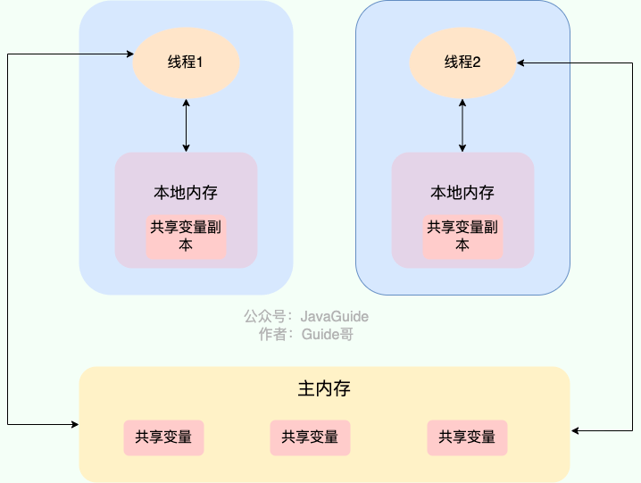

### volatile关键字
volatile关键字修饰的变量，可以使得线程从自身的本地内存读取拷贝的共享变量副本 变为强制的从主内存的读取共享变量。


volatile 关键字能保证数据的可见性，防止 JVM 的指令重排序,但不能保证数据的原子性。synchronized 关键字两者都能保证


## 乐观锁与悲观锁

### 悲观锁
假设最坏的情况，认为共享资源每次被访问时都会出现问题，因此每次在获取资源操作的时候都会上锁，这样其他线程想要拿到这个资源就会阻塞直到锁被上一个持有者释放。
synchronized和ReentrantLock等独占锁就是悲观锁思想的实现。
悲观锁的主要思想是在操作数据之前，先锁定数据，以防止其他线程同时对数据进行修改。
```java
public void performSynchronisedTask() {
    synchronized (this) {
        // 需要同步的操作
    }
}

private Lock lock = new ReentrantLock();
lock.lock();
try {
   // 需要同步的操作
} finally {
    lock.unlock();
}
```
高并发的场景下，激烈的锁竞争会造成线程阻塞，大量阻塞线程会导致系统的上下文切换，增加系统的性能开销。并且，悲观锁还可能会存在死锁问题，影响代码的正常运行。

### 乐观锁
假设好的情况，认为共享资源不会每次访问都出问题，线程可以不用加锁等待，只要在提交修改的时候验证对应的资源是否被其他线程修改了。使用版本号机制、或者CAS算法。

AtomicInteger、LongAdder就是使用了乐观锁的一种实现方式CAS实现的。

乐观锁和悲观锁的选择:
* 悲观锁通常多用于写比较多的情况（多写场景，竞争激烈），这样可以避免频繁失败和重试影响性能，悲观锁的开销是固定的。不过，如果乐观锁解决了频繁失败和重试这个问题的话（比如LongAdder），也是可以考虑使用乐观锁的，要视实际情况而定。
* 乐观锁通常多用于写比较少的情况（多读场景，竞争较少），这样可以避免频繁加锁影响性能。不过，乐观锁主要针对的对象是单个共享变量（参考java.util.concurrent.atomic包下面的原子变量类）。

#### 版本号机制
数据库中加一个version字段，读取数据的时候查询出来当前版本号，更新完数据写入数据库时判断数据库里的版本号跟读取的时候的版本号是否一致，
如果一致则更新，如果不一致则说明数据被其他线程变更，不进行更新，重试直到更新成功。

#### CAS算法
CAS算法（比较与交换）。用于实现乐观锁，被广泛用于各大框架中。
CAS是一个原子操作，依赖于cpu的原子指令。
涉及三个值
* V：要更新的变量值（Var）
* E：预期值（Expected）
* N：拟写入的值（New）

当前仅当变量值V等于预期值E时，才会将N的值更新变量V。如果不相等，则说明变量V已经被其他线程更新。
当多个线程使用CAS操作一个变量时，只有一个会胜出并且成功更新，其余会失败，可以重试。


sun.misc包下的Unsafe类提供了compareAndSwapObject、compareAndSwapInt、compareAndSwapLong方法来实现的对Object、int、long类型的 CAS 操作
```java
/**
  *  CAS
  * @param o         包含要修改field的对象
  * @param offset    对象中某field的偏移量
  * @param expected  期望值
  * @param update    更新值
  * @return          true | false
  */
public final native boolean compareAndSwapObject(Object o, long offset,  Object expected, Object update);

public final native boolean compareAndSwapInt(Object o, long offset, int expected,int update);

public final native boolean compareAndSwapLong(Object o, long offset, long expected, long update);

```

#### 乐观锁的ABA问题

线程1读取变量值的结果是A，下次读取到还是A，不一定说明这个值没有被变动过。有可能其他线程修改后又改回了A。

ABA 问题的解决思路是在变量前面追加上版本号或者时间戳。全部相等才更新。

#### 乐观锁重试
CAS 经常会用到自旋操作来进行重试，也就是不成功就一直循环执行直到成功。如果长时间不成功，会给 CPU 带来非常大的执行开销。


## synchronized关键字

### synchronized定义
synchronized 是 Java 中的一个关键字，翻译成中文是同步的意思，主要解决的是多个线程之间访问资源的同步性，可以保证被它修饰的方法或者代码块在任意时刻只能有一个线程执行。

### synchronized使用
三种使用方式:
* 修饰实例方法（锁当前对象实例）
* 修饰静态方法（锁当前类）
* 修饰代码块(锁定当前的类/对象)

静态 synchronized 方法和非静态 synchronized 方法之间的不互斥。
如果一个线程 A 调用一个实例对象的非静态 synchronized 方法，而线程 B 需要调用这个实例对象所属类的静态 synchronized 方法，是允许的，不会发生互斥现象。
因为访问静态 synchronized 方法占用的锁是当前类的锁，而访问非静态 synchronized 方法占用的锁是当前实例对象锁。

### 底层原理

synchronized 同步语句块的实现使用的是 monitorenter 和 monitorexit 指令，其中 monitorenter 指令指向同步代码块的开始位置，monitorexit 指令则指明同步代码块的结束位置。
当执行 monitorenter 指令时，线程试图获取锁也就是获取 对象监视器 monitor 的持有权。在 Java 虚拟机(HotSpot)中，Monitor 是基于 C++实现的，由ObjectMonitoropen in new window实现的。每个对象中都内置了一个 ObjectMonitor对象。另外，wait/notify等方法也依赖于monitor对象，这就是为什么只有在同步的块或者方法中才能调用wait/notify等方法，否则会抛出java.lang.IllegalMonitorStateException的异常的原因。


synchronized 修饰的方法并没有 monitorenter 指令和 monitorexit 指令，取得代之的确实是 ACC_SYNCHRONIZED 标识，该标识指明了该方法是一个同步方法。


## ReentrantLock
### 定义
ReentrantLock实现了Lock接口，是一个可重入且独占式的锁。更加灵活、强大，增加了轮询、超时、公平锁、非公平锁的功能。
```java
public class ReentrantLock implements Lock, java.io.Serializable {
    private final Sync sync;
    abstract static class Sync extends AbstractQueuedSynchronizer {
        private static final long serialVersionUID = -5179523762034025860L;

        /**
         * Performs {@link Lock#lock}. The main reason for subclassing
         * is to allow fast path for nonfair version.
         */
        abstract void lock();
        final boolean nonfairTryAcquire(int acquires) {
            final Thread current = Thread.currentThread();
            int c = getState();
            if (c == 0) {
                if (compareAndSetState(0, acquires)) {
                    setExclusiveOwnerThread(current);
                    return true;
                }
            }
            else if (current == getExclusiveOwnerThread()) {
                int nextc = c + acquires;
                if (nextc < 0) // overflow
                    throw new Error("Maximum lock count exceeded");
                setState(nextc);
                return true;
            }
            return false;
        }

        protected final boolean tryRelease(int releases) {
            int c = getState() - releases;
            if (Thread.currentThread() != getExclusiveOwnerThread())
                throw new IllegalMonitorStateException();
            boolean free = false;
            if (c == 0) {
                free = true;
                setExclusiveOwnerThread(null);
            }
            setState(c);
            return free;
        }

        protected final boolean isHeldExclusively() {
            // While we must in general read state before owner,
            // we don't need to do so to check if current thread is owner
            return getExclusiveOwnerThread() == Thread.currentThread();
        }

        final ConditionObject newCondition() {
            return new ConditionObject();
        }

        // Methods relayed from outer class

        final Thread getOwner() {
            return getState() == 0 ? null : getExclusiveOwnerThread();
        }

        final int getHoldCount() {
            return isHeldExclusively() ? getState() : 0;
        }

        final boolean isLocked() {
            return getState() != 0;
        }

        /**
         * Reconstitutes the instance from a stream (that is, deserializes it).
         */
        private void readObject(java.io.ObjectInputStream s)
                throws java.io.IOException, ClassNotFoundException {
            s.defaultReadObject();
            setState(0); // reset to unlocked state
        }
    }
}
```

ReentrantLock默认使用非公平锁，也可以通过构造函数显示指定使用公平锁。
```java
// 传入一个 boolean 值，true 时为公平锁，false 时为非公平锁
public ReentrantLock(boolean fair) {
    sync = fair ? new FairSync() : new NonfairSync();
}
```

#### 公平锁与非公平锁
* 公平锁：锁被释放后，先申请资源的线程先获得锁。保证了时间顺序
* 非公平锁: 锁被释放后，后申请资源的线程也可能获得锁，是随机或者按照其他优先级排序的。性能更好，但是有可能有的线程永远获取不到锁。

可重入锁: 也叫递归锁。线程获取了对象锁之后，可以再次获取这个对象锁。

### synchronized 和 ReentrantLock两者比较
1. 两者都是可重入锁。
2. synchronized 依赖于 JVM虚拟机实现，而 ReentrantLock 依赖于 JDK API实现。
3. ReentrantLock新增了一些高级功能
* 可实现公平锁，synchronized是非公平锁
* 可实现选择性通知（锁可以绑定多个条件），通过condition接口来实现。
* 等待可中断：正在等待的线程可以选择放弃等待，改为处理其他事情。lock.lockInterruptibly()


### 可中断锁与不可中断锁
* 可中断锁：获取锁的过程中可以被中断，不需要一直等到获取锁之后 才能进行其他逻辑处理。ReentrantLock 就属于是可中断锁。
* 不可中断锁：一旦线程申请了锁，就只能等到拿到锁以后才能进行其他的逻辑处理。 synchronized 就属于是不可中断锁。


