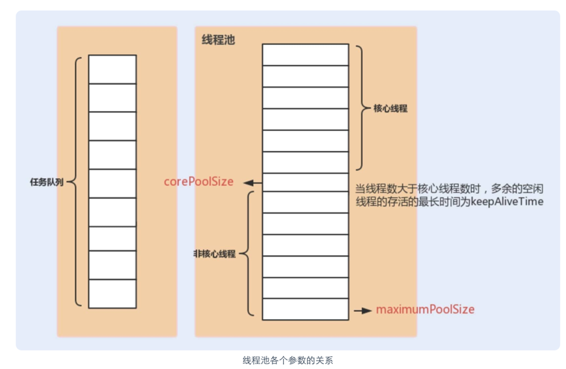

## ThreadLocal
ThreadLocal可以使得每个线程绑定自己线程的变量，存放每个线程私有数据。 可以使用 get() 和 set() 方法来获取默认值或将其值更改为当前线程所存的副本的值，从而避免了线程安全问题。


### ThreadLocal的实现方式
ThreadLocal最终的变量是放在了当前线程Thread的 ThreadLocalMap 中，并不是存在 ThreadLocal 上，ThreadLocal 可以理解为只是ThreadLocalMap的封装，传递了变量值。
ThreadLocal 类中可以通过Thread.currentThread()获取到当前线程对象后，直接通过getMap(Thread t)可以访问到该线程的ThreadLocalMap对象。每个Thread中都具备一个ThreadLocalMap，而ThreadLocalMap可以存储以ThreadLocal为 key ，Object 对象为 value 的键值对。

## 线程池
### 定义
线程池就是管理一系列线程的资源池。当有任务要处理时，直接从线程池中获取线程来处理，处理完之后线程并不会立即被销毁，而是等待下一个任务

### 线程池的优点
减少每次获取资源的消耗，提高对资源的利用率。
* 降低资源消耗。通过重复利用已创建的线程降低线程创建和销毁造成的消耗。
* 提高响应速度。当任务到达时，任务可以不需要等到线程创建就能立即执行。
* 提高线程的可管理性。线程是稀缺资源，如果无限制的创建，不仅会消耗系统资源，还会降低系统的稳定性，使用线程池可以进行统一的分配，调优和监控。

### 创建线程池的方法
1. 通过ThreadPoolExecutor构造函数来创建（推荐）。
```java
public ThreadPoolExecutor(int corePoolSize,
    int maximumPoolSize,
    long keepAliveTime,
    TimeUnit unit,
    BlockingQueue<Runnable> workQueue) {
    this(corePoolSize, maximumPoolSize, keepAliveTime, unit, workQueue,
    Executors.defaultThreadFactory(), defaultHandler);
} 
```

2. 通过 Executor 框架的工具类 Executors 来创建。
* FixedThreadPool：该方法返回一个固定线程数量的线程池。该线程池中的线程数量始终不变。当有一个新的任务提交时，线程池中若有空闲线程，则立即执行。若没有，则新的任务会被暂存在一个任务队列中，待有线程空闲时，便处理在任务队列中的任务。
* SingleThreadExecutor： 该方法返回一个只有一个线程的线程池。若多余一个任务被提交到该线程池，任务会被保存在一个任务队列中，待线程空闲，按先入先出的顺序执行队列中的任务。
* CachedThreadPool： 该方法返回一个可根据实际情况调整线程数量的线程池。初始大小为 0。当有新任务提交时，如果当前线程池中没有线程可用，它会创建一个新的线程来处理该任务。如果在一段时间内（默认为 60 秒）没有新任务提交，核心线程会超时并被销毁，从而缩小线程池的大小。
* ScheduledThreadPool：该方法返回一个用来在给定的延迟后运行任务或者定期执行任务的线程池。

《阿里巴巴 Java 开发手册》中强制线程池不允许使用 Executors 去创建，而是通过 ThreadPoolExecutor 构造函数的方式，这样的处理方式让写的同学更加明确线程池的运行规则，规避资源耗尽的风险

Executors 返回线程池对象的弊端如下:
* FixedThreadPool 和 SingleThreadExecutor：使用的是无界的 LinkedBlockingQueue，任务队列最大长度为 Integer.MAX_VALUE,可能堆积大量的请求，从而导致 OOM。
* CachedThreadPool：使用的是同步队列 SynchronousQueue, 允许创建的线程数量为 Integer.MAX_VALUE ，如果任务数量过多且执行速度较慢，可能会创建大量的线程，从而导致 OOM。
* ScheduledThreadPool 和 SingleThreadScheduledExecutor : 使用的无界的延迟阻塞队列DelayedWorkQueue，任务队列最大长度为 Integer.MAX_VALUE,可能堆积大量的请求，从而导致 OOM。

```java
// 无界队列 LinkedBlockingQueue
public static ExecutorService newFixedThreadPool(int nThreads) {

    return new ThreadPoolExecutor(nThreads, nThreads,0L, TimeUnit.MILLISECONDS,new LinkedBlockingQueue<Runnable>());

}

// 无界队列 LinkedBlockingQueue
public static ExecutorService newSingleThreadExecutor() {

    return new FinalizableDelegatedExecutorService (new ThreadPoolExecutor(1, 1,0L, TimeUnit.MILLISECONDS,new LinkedBlockingQueue<Runnable>()));

}

// 同步队列 SynchronousQueue，没有容量，最大线程数是 Integer.MAX_VALUE`
public static ExecutorService newCachedThreadPool() {

    return new ThreadPoolExecutor(0, Integer.MAX_VALUE,60L, TimeUnit.SECONDS,new SynchronousQueue<Runnable>());

}

// DelayedWorkQueue（延迟阻塞队列）
public static ScheduledExecutorService newScheduledThreadPool(int corePoolSize) {
    return new ScheduledThreadPoolExecutor(corePoolSize);
}
public ScheduledThreadPoolExecutor(int corePoolSize) {
    super(corePoolSize, Integer.MAX_VALUE, 0, NANOSECONDS,
          new DelayedWorkQueue());
}

```

ThreadPoolExecutor创建的核心参数
* corePoolSize：当队列未达到队列容量时，最大可以同时运行的线程数
* maximumPoolSize: 任务队列存放的任务达到队列的容量时，当前可以同时可以运行的线程数变为最大线程数。当队列满了，则会创建新的线程来执行任务，最大线程数为此值。
* workQueue: 新任务来的时候会判断当前运行的线程数是否达到核心线程数，如果未达到，则会使用线程来跑。如果达到了，新任务会放到队列中。
* keepAliveTime：线程数量大于corePoolSize的时候，如果没有新任务运行，线程不会立马销毁，而是会等待，等待时间如果超过keepAliveTime，则会被回收销毁。直到线程数等于corePoolSize为止。
* unit: keepAliveTime的时间单位
* threadFactory: 创建线程的工厂
* handler：队列满之后的添加策略



### 线程执行的拒绝策略
如果当前同时运行的线程数量达到最大线程数量并且队列也已经被放满了任务时，ThreadPoolExecutor 定义一些策略:
* ThreadPoolExecutor.AbortPolicy： 抛出 RejectedExecutionException来拒绝新任务的处理。
* ThreadPoolExecutor.CallerRunsPolicy： 调用执行自己的线程运行任务，也就是直接在调用execute方法的线程中运行(run)被拒绝的任务，如果执行程序已关闭，则会丢弃该任务。因此这种策略会降低对于新任务提交速度，影响程序的整体性能。如果您的应用程序可以承受此延迟并且你要求任何一个任务请求都要被执行的话，你可以选择这个策略。
* ThreadPoolExecutor.DiscardPolicy: 不处理新任务，直接丢弃掉。
* ThreadPoolExecutor.DiscardOldestPolicy: 此策略将丢弃最早的未处理的任务请求.

### 阻塞队列选择
新任务来的时候会先判断当前运行的线程数量是否达到核心线程数，如果达到的话，新任务就会被存放在队列中。
* 容量为 Integer.MAX_VALUE 的 LinkedBlockingQueue（无界队列） (核心线程数 其实就是等于最大线程数)
* SynchronousQueue（同步队列）：CachedThreadPool 。SynchronousQueue 没有容量，不存储元素，目的是保证对于提交的任务，如果有空闲线程，则使用空闲线程来处理；否则新建一个线程来处理任务。也就是说，CachedThreadPool 的最大线程数是 Integer.MAX_VALUE ，可以理解为线程数是可以无限扩展的，可能会创建大量线程，从而导致 OOM。
* DelayedWorkQueue（延迟阻塞队列）：ScheduledThreadPool 和 SingleThreadScheduledExecutor 。DelayedWorkQueue 的内部元素并不是按照放入的时间排序，而是会按照延迟的时间长短对任务进行排序，内部采用的是“堆”的数据结构，可以保证每次出队的任务都是当前队列中执行时间最靠前的。DelayedWorkQueue 添加元素满了之后会自动扩容原来容量的 1/2，即永远不会阻塞，最大扩容可达 Integer.MAX_VALUE，所以最多只能创建核心线程数的线程。


### Semaphore
Semaphore 是一种用于控制对共享资源的访问的同步工具。Semaphore 维护了一个许可的计数器，线程可以通过 acquire() 方法获取许可，通过 release() 方法释放许可.
如果许可计数器为正数，则 acquire() 将成功，将许可计数器减 1；如果许可计数器为零，则 acquire() 将阻塞，直到有一个许可可用为止。


Semaphore 在多线程编程中有许多应用场景，其中一些包括：

* 资源池管理：Semaphore 可以用于管理有限资源池，比如数据库连接池、线程池等。Semaphore 的许可数量可以表示资源池中可用资源的数量，每个线程在使用资源前需要获取许可，使用完后释放许可，这样可以控制资源的并发访问数量，避免资源被过度消耗。

* 流量控制：Semaphore 可以用于限制对某些共享资源的并发访问数量，比如限制同时访问某个文件或某个网络连接的线程数量，防止过多的线程同时访问导致性能下降或系统崩溃。

* 线程同步：Semaphore 可以用于线程间的同步，比如某些场景下需要保证一组线程按照一定顺序执行，可以使用 Semaphore 控制线程的执行顺序。

* 信号灯控制：Semaphore 在模拟信号灯的场景中也很有用。比如控制交叉路口的车辆流量，Semaphore 可以表示不同方向上的车辆流量，通过控制不同方向的许可数量来实现交通流量的控制。

* 限流：在某些场景下，为了保护系统免受过多请求的影响，可以使用 Semaphore 来限制请求的并发数量，防止系统被过载。

### CountDownLatch
CountDownLatch 的作用是允许一个或多个线程等待其他线程完成操作后再继续执行。允许count个线程阻塞在一个地方，直到所有线程的任务都执行完成。
CountDownLatch 维护了一个计数器，该计数器由一个正整数初始化。线程调用 CountDownLatch 的 await() 方法会阻塞，直到计数器减到零。其他线程可以通过调用 CountDownLatch 的 countDown() 方法来将计数器减一。一旦计数器减到零，所有等待的线程都会被释放，可以继续执行。
CountDownLatch使用完毕后不能被重复使用。

CountDownLatch的使用可以被CompletableFuture的allOf、join使用代替。

### CycleBarrier
CycleBarrier和CountDownLatch类似,比CountDownLatch功能复杂。它允许一组线程相互等待，直到达到某个公共屏障点（barrier），然后同时继续执行。
CountDownLatch 是一次性的，一旦计数器减到零，就无法重置；而 CyclicBarrier 是可循环使用的，一旦所有线程都到达屏障点，它会自动重置计数器，并且所有线程可以继续执行，而不需要创建新的 CyclicBarrier 实例。

CyclicBarrier 主要用于以下场景：

* 任务分解： 当一个任务可以分解成多个子任务，每个子任务可以独立执行，但最终需要在某个屏障点进行汇总或协作时，可以使用 CyclicBarrier 来实现线程之间的同步等待。

* 数据处理： 当多个线程同时处理数据，但需要等待所有线程完成各自的数据处理后再进行下一步操作时，可以使用 CyclicBarrier。

* 多阶段计算： 当计算过程分为多个阶段，每个阶段的计算都是相互独立的，但在进入下一阶段之前需要等待所有线程完成当前阶段的计算时，可以使用 CyclicBarrier 来协调各个阶段之间的计算。

