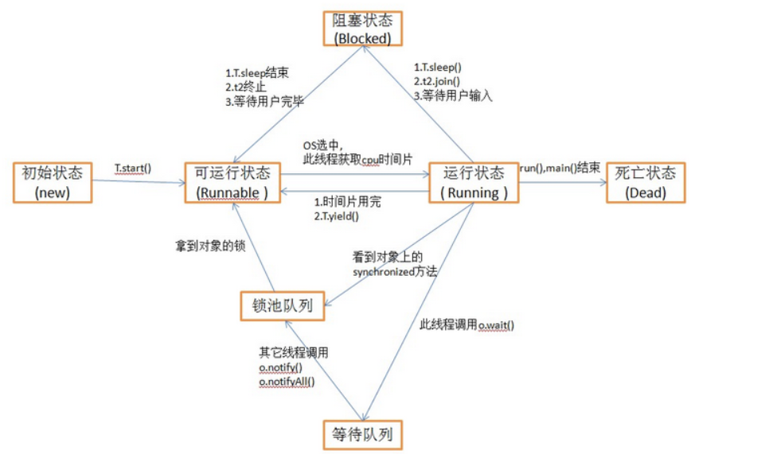
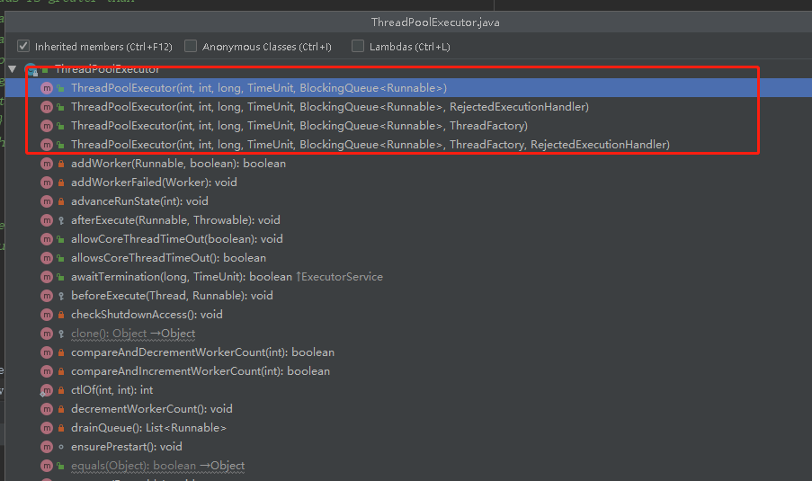

## 多线程的三种实现方法
- 继承Thread类，重写Thread类的run方法
- 实现Runnable接口，实现接口中的run方法,将Runnable接口的实现类当做对象传给Thread类初始化
- 实现Callable接口，实现接口中的call方法，其中该方法还可以返回执行的目标结果，可以声明抛出异常。创建FutureTask类，将Callable接口当做参数。
然后将FutureTask当做参数创建Thread类初始化，通过FutureTask的get方法可以获取线程的返回值。

### 执行线程方法 
Thread thread = new Thread(Runnable接口);  

调用线程的start方法才是开启新的线程执行,只单独调用run方法的话跟普通的方法是一样的，是没有开启新的线程的。

thread.start();

```
 static class Thread1 extends Thread{
        @Override
        public void run(){
            System.out.println(Thread.currentThread().getName()+" extends thread test");
        }
    }

    static class RunnableThread2 implements Runnable{
        @Override
        public void run(){
            System.out.println(Thread.currentThread().getName()+" implements runnable thread test");
        }
    }

    static class CallableThread3 implements Callable<String>{
        @Override
        public String call() throws Exception {
            System.out.println(Thread.currentThread().getName()+" implements callable thread test");
            Thread.sleep(10000);
            return "execute OK";
        }
    }

    public static void main(String[] args) {
        Thread thread1 = new Thread1();
        thread1.start();
        Thread thread2 = new Thread(new RunnableThread2());
        thread2.start();
        FutureTask<String> future = new FutureTask<String>(new CallableThread3());
        Thread thread3 = new Thread(future);
        thread3.start();
        try {
            String s = future.get();
            System.out.println(s);
        } catch (Exception e) {
            e.printStackTrace();
        }

```
### 线程的主要状态
- 初始状态（New）：新创建了一个线程对象，但是还没有调用start()方法
- 可运行（Runnable）：线程创建后，调用了start（）方法。该线程处于可运行的线程池中，等待被线程调度选中，获得cpu的使用权。
- 运行（Running）：可运行状态的线程获得了cpu时间片，执行程序代码
- 阻塞（BLOCKED）: 阻塞状态是指线程因为某种原因放弃了cpu使用权，让出了cpu，暂时停止运行，直到线程进入可运行状态才有机会再获取cpu执行。
  等待阻塞：线程调用了wait()方法，JVM会把线程放到等待队列中
  同步阻塞：在获取对象的同步锁时，该同步锁被其他现场占用，JVM会把线程放到锁池中
  其他阻塞：执行sleep（）方法或者join（）方法，或者发出IO请求时，会变成阻塞状态，当sleep等方法结束时变成可运行状态。
- 死亡（Dead）：run（）方法、main（）方法结束，或者因为异常退出时，则线程结束了声明周期
 
## 线程池核心参数


线程池的4个构造函数
 
 主要包含几个核心参数
 - corePoolSize: 保留在线程池的核心线程数
 - maximumPoolSize： 线程池中允许的最大线程数
 - keepAliveTime： 线程的保留时间
 - unit： 线程保留时间单位，毫秒、秒、分钟
 - workQueue：线程池队列，用于在执行任务之前保存任务的队列。 此队列将仅保存由 {@code execute} 方法提交的 {@code Runnable} 任务。
 - RejectedExecutionHandler： 拒绝异常策略
 
 
 
 
 
 
 
 @FunctionalInterface注解
 代表函数式接口，该注解只能标记在"有且仅有一个抽象方法"的接口上。JDK8接口中的静态方法和默认方法，都不算是抽象方法。该注解不是必须的，如果一个接口符合"函数式接口"定义，那么加不加该注解都没有影响。加上该注解能够更好地让编译器进行检查。如果编写的不是函数式接口，但是加上了@FunctionInterface，那么编译器会报错。
 